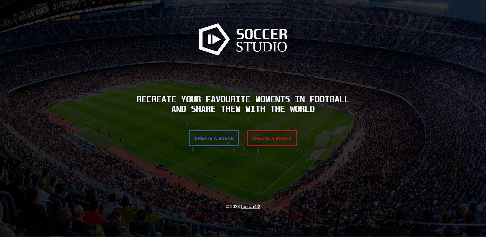
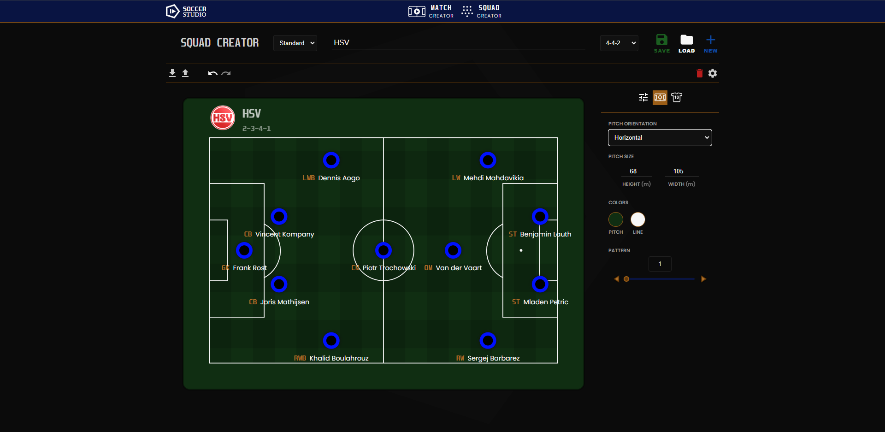
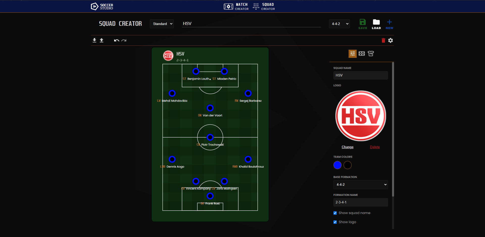
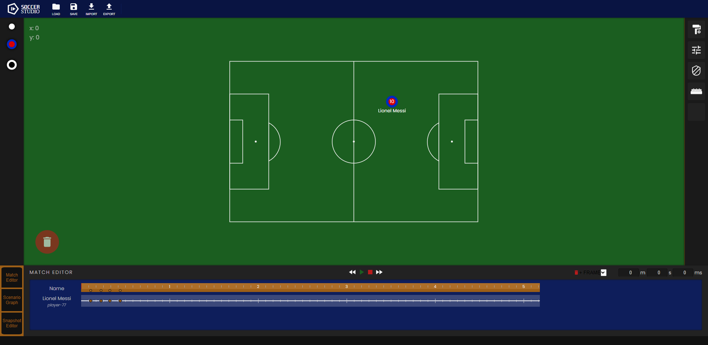

# Soccer Studio
A simple tool for creating football squads, animations and scenarios.

## Project setup
Run `npm install` to install the dependencies and `npm run serve` to run the project.

## Project state
Currently, only the squad creator works decent enough to be usable, while the match editor is still in its very early states.

